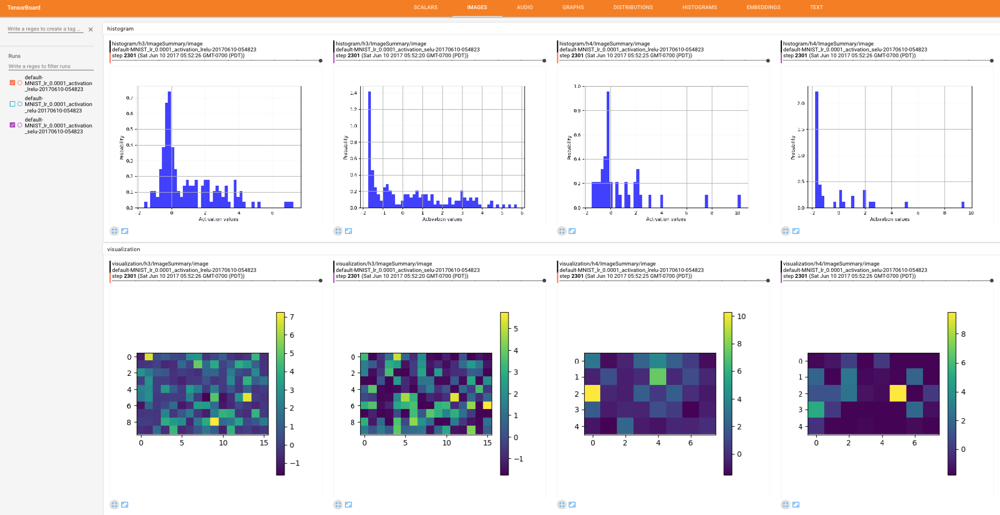
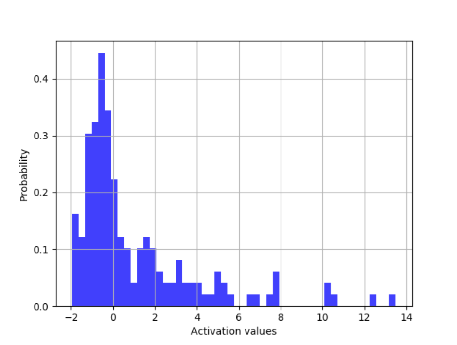
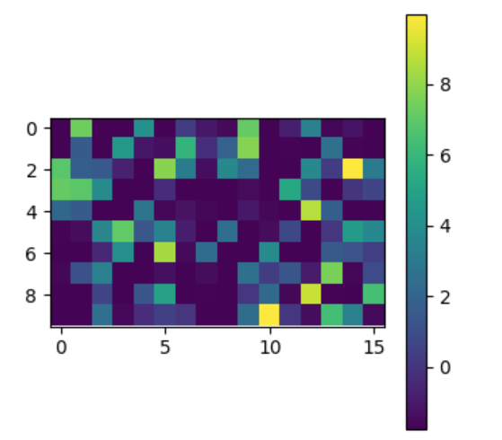
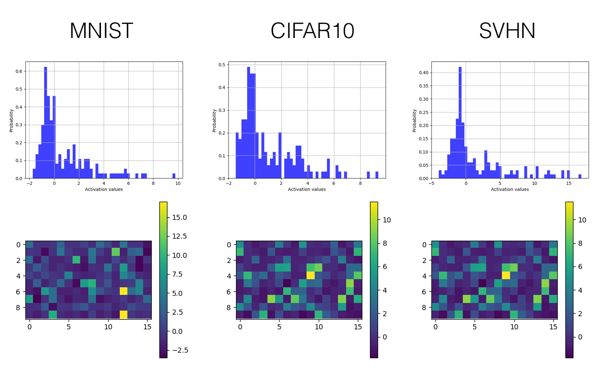
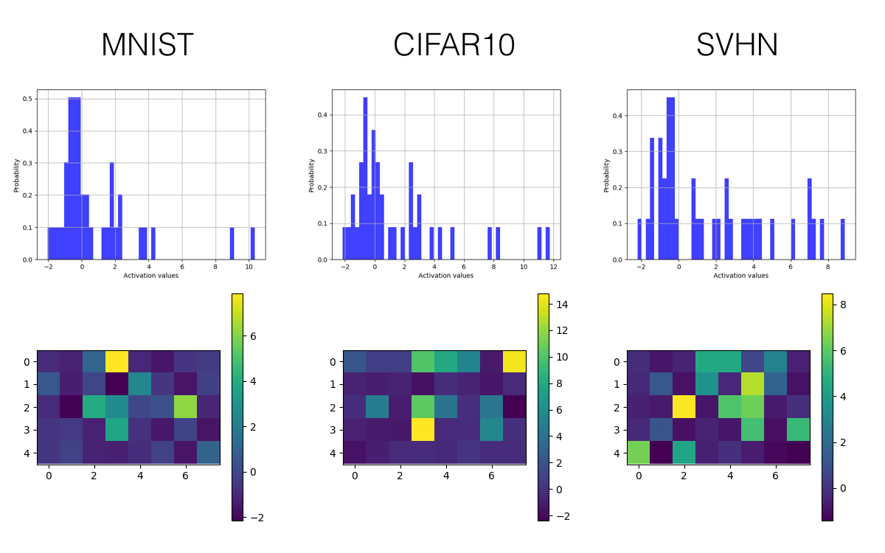
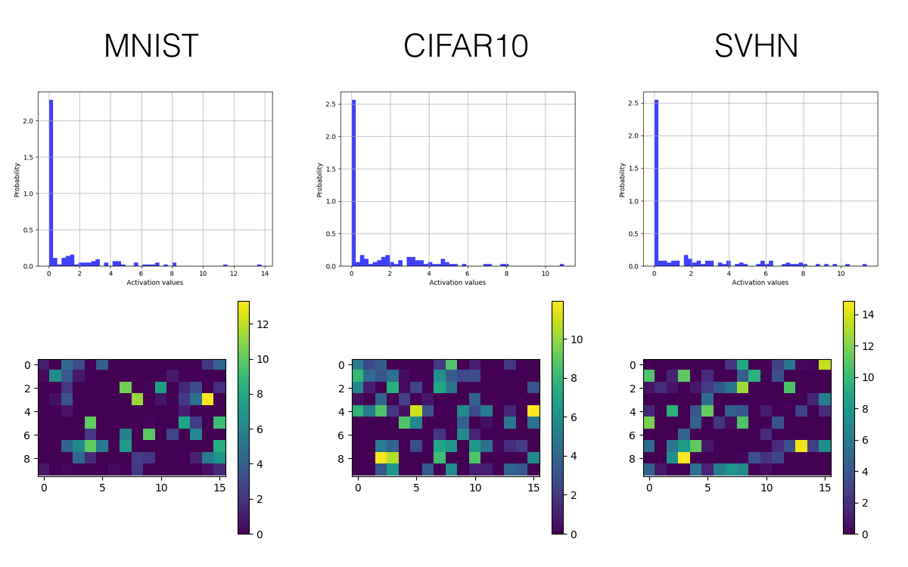
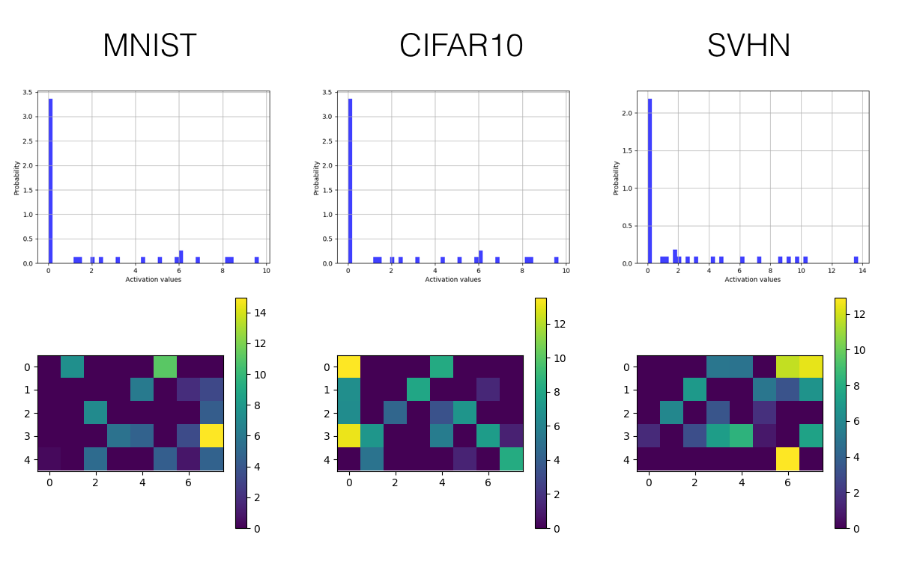

# SELUs (scaled exponential linear units) - Visualized and Histogramed Comparisons among ReLU and Leaky ReLU

## Descriptions
This project includes a [Tensorflow](https://www.tensorflow.org/) implementation of SELUs (scaled exponential linear units) proposed in this paper [Self-Normalizing Neural Networks](https://arxiv.org/abs/1706.02515). Also, aiming to present clear at a glance comparisons among SELU, ReLU, Leaky ReLU, etc, this implementation focuses on visualizing and histogramming activations on [Tensorboard](https://www.tensorflow.org/get_started/summaries_and_tensorboard). As a result, the drawn visualization and histogram are nicely incorporating with Tensorboard by introducing plotting summaries. Examples of visualization and histogram are as follows.

, 

Ideally, desire activations of every layer are close to *zero mean* and *unit variance* to make tensors propagated through several layers converge towards zero mean and unit variance. The learning can, therefore, be stabilized by preventing gradients from being vanishing and exploding. In this work, the authors propose scaled exponential linear units (SELUs) which aim to automatically shift and rescale neuron activations towards zero mean and unit variance without explicit normalization like what batch normalization technique does. 

Intending to empirically verify the effectiveness of the proposed activations, a convolutional neural network consisting of three convolutional layers followed by three fully connected layers was implemented to be trained on image classification tasks on datasets such as MNIST, SVHN, and CIFAR10. To overcome the limited content allowed to be shown on Tensorboard, a plotting library [Tensorflow Plot](https://github.com/wookayin/tensorflow-plot) aiming to bridge the gap between Python plotting libraries and Tensorboard is introduced. Again, here are some examples.

* Histogram of activations on Tensorboard

, 

* Visualization of activations on Tensorboard

, 


The implemented model is trained and tested on three publicly available datasets: [MNIST](http://yann.lecun.com/exdb/mnist/), [SVHN](http://ufldl.stanford.edu/housenumbers/), and [CIFAR-10](https://www.cs.toronto.edu/~kriz/cifar.html).

\*This code is still being developed and subject to change.

## Prerequisites

- Python 2.7 or Python 3.3+
- [Tensorflow 1.0.0](https://github.com/tensorflow/tensorflow/tree/r1.0)
- [Tensorflow Plot](https://github.com/wookayin/tensorflow-plot)
- [SciPy](http://www.scipy.org/install.html)
- [NumPy](http://www.numpy.org/)

## Usage

### Datasets
Download datasets with:
```bash
$ python download.py --dataset MNIST SVHN CIFAR10
```

### Just do it
Simply run comparisons among the default activations including SELU, ReLU, and Leaky ReLU
```bash
python script.py
```
Note that this script will 
* Clean up the default directory *train_dir*, 
* Run three training jobs with the same settings of the model architecture, learning rate, dataset but differing from the employed activations (ReLU, Leaky ReLU, and SELU, respectively), and 
* Launch Tensorboard on the provided default port (localhost:7007).

### Use your own settings
You can change several setting with the args including batch size, learning rate and the weight decay applied to it, dataset, activations, etc. Also, if you want to test other model architectures or other activations such as sigmoid or tanh, it's also easy.

Here are some examples:

Train models with different activation functions with downloaded datasets:
```bash
$ python trainer.py --dataset MNIST --activation relu --learning_rate 1e-3
$ python trainer.py --dataset SVHN --activation lrelu --batch_size 128
$ python trainer.py --dataset CIFAR10 --activation selu --lr_weight_decay
```
Train and test your own datasets:

* Create a directory
```bash
$ mkdir datasets/YOUR_DATASET
```

* Store your data as an h5py file datasets/YOUR_DATASET/data.hy and each data point contains
    * 'image': has shape [h, w, c], where c is the number of channels (grayscale images: 1, color images: 3)
    * 'label': represented as an one-hot vector
* Maintain a list datasets/YOUR_DATASET/id.txt listing ids of all data points
* Modify trainer.py including args, data_info, etc.
* Finally, train and test models:
```bash
$ python trainer.py --dataset YOUR_DATASET
$ python evaler.py --dataset YOUR_DATASET
```
## Results

Only the histogram and visualized activations of the last convolutional layer (3rd layer) and the first fully connected layer (4th layer) are selected to be presented here. (Trained for 10k iterations)

### SELU
* The convolutional layer



* The fully connected layer



### ReLU
* The convolutional layer



* The fully connected layer



### Leaky ReLU
* The convolutional layer


* The fully connected layer


## Related works
* [Self-Normalizing Neural Networks](https://arxiv.org/pdf/1706.02515.pdf) by Klambauer et. al
* [Rectified Linear Units Improve Restricted Boltzmann Machines](http://www.cs.toronto.edu/~fritz/absps/reluICML.pdf) by Nair et. al.
* [Empirical Evaluation of Rectified Activations in Convolutional Network](https://arxiv.org/abs/1505.00853) by Xu et. al.

## Author

Shao-Hua Sun / [@shaohua0116](https://shaohua0116.github.io/) @ [Joseph Lim's research lab](https://github.com/gitlimlab) @ USC

## Acknowledgement
The code *monitor.py* was written by [@wookayin](https://github.com/wookayin/)
